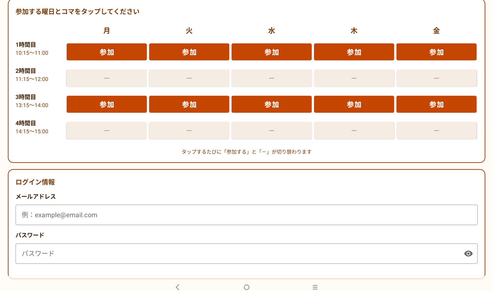
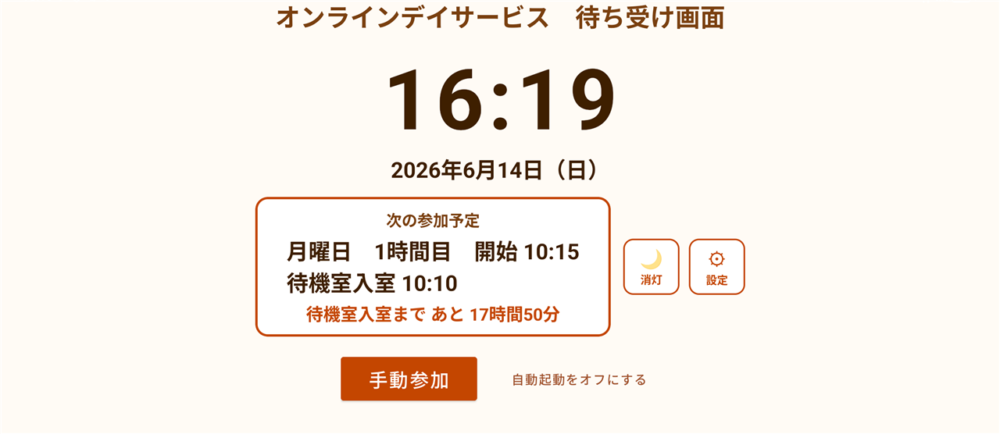

# オンラインデイサービス長老大学  Android版アプリ 使い方ガイド

Android（タブレット・スマートフォン）から、オンラインデイサービス長老大学に参加するためのアプリの使い方です。

**むずかしい設定はいりません。** はじめに一度だけ**アカウント（メールアドレス・パスワード）を登録**しておけば、あとは参加したい時間にアプリを開いて、**「参加」ボタンを1回押すだけ**です。

> ✅ **まずはこれだけで大丈夫です。** ほとんどの方は、この「ボタンを押して参加」だけで毎日ご参加いただけます。
>  「毎回ボタンを押すのも大変」という方のために、**時間になると自動ではじまる設定**も、あとのほうで（[さらにラクにしたい方へ](#さらにラクにしたい方へ時間になったら自動ではじまる自動起動)）ご案内します。**必要な方だけ**でかまいません。

> 📌 **このアプリは「オンラインデイサービス長老大学」をご契約中の方向け**です。参加には、事務局よりご案内したログイン情報（メールアドレス・パスワード）が必要です。

---

## ① アプリを入れる（最初に1回だけ）

1. お使いのAndroid端末で、次のリンクを開きます。
    👉 **[Google Play でアプリを開く](https://play.google.com/store/apps/details?id=jp.chouroudaigaku.onlinedayservice)**
2. **「インストール」** を押すと、自動でインストールされます。
3. 終わったら **「開く」**、または次回からは**ホーム画面のアイコン**「デイサービス自動起動」から起動できます。

> 💡 Google Play で **「オンラインデイサービス長老大学」** と検索しても見つかります。

---

## ② アカウントを登録する（最初に1回だけ）

はじめてアプリを開くと、まず**準備の画面（許可）**が順番に出てきます。
どれも **画面の案内どおりに「許可する」→「許可」** を押していけば大丈夫です。むずかしく考えなくてOKです。

| 画面 | なんのため？ |
|------|------------|
| 🔔 通知 | デイサービスの時間をお知らせするため |
| ⏰ アラーム | 時間ぴったりにお知らせ・起動するため |
| 🔋 電池の設定 | 時間どおりに動くため |
| 🎥 カメラとマイク | ビデオ通話で顔と声を届けるため |

すべて押し終えると、この画面が出ます。**「はじめる」**を押してください。

### つづけて、メールアドレスとパスワードを登録します

1. 待ち受け画面の右上にある **「⚙ 設定」ボタンを長押し**（少し長めに押す）します。
2. 「設定画面を開きますか？」と出たら **「設定を開く」** を押します。
3. **事務局よりご案内したログイン情報（メールアドレス・パスワード）**を入力します。
4. **「💾 この内容で保存する」** を押せば、アカウントの登録は完了です。

> 💡 設定画面には「参加する曜日・時間」を選ぶ表もありますが、**ここではまだ触らなくて大丈夫**です（自動ではじめたい方だけ、あとで設定します）。

---

## ③ 参加する（毎回、これだけ）

参加したい時間になったら、

1. アプリを開きます（ホーム画面の「デイサービス自動起動」アイコン）。
2. 画面の **「手動参加」ボタンを1回押す**だけです。

これでクラス（授業）に入れます。授業が終わったら、この待ち受け画面に戻ります。

> 💡 これだけで毎日ご参加いただけます。**次の「さらにラクにしたい方へ」は、読まなくてもかまいません。**

---

## さらにラクにしたい方へ：時間になったら自動ではじまる（自動起動）

「毎回アプリを開いてボタンを押すのが大変」「押し忘れが心配」という方は、**参加する曜日・時間を一度だけ登録**しておくと、あとは**時間になるとアプリが自動で起動して待機室に入ります**。アプリを閉じていても、画面が消えていても、時間になれば自動で立ち上がります。

### 1. 参加する曜日・時間を登録する

1. 待ち受け画面の右上 **「⚙ 設定」ボタンを長押し** →「設定を開く」を押します。
2. 表の中で、参加したい**曜日 × 時間**のマスをタップします。
    タップするたびに **「参加」**（オレンジ色）と **「－」** が切り替わります。
   - 例：「**月〜金の1時間目と3時間目**」に参加、など。毎週この予定がくり返されます。お休みの曜日は「－」のままでOKです。
3. 最後に **「💾 この内容で保存する」** を押せば完了です。

### 2. あとは置いておくだけ

- 時間になると、**自動でアプリが起動して待機室に入ります**。
- 待ち受け画面には、**次にいつ参加するか**が表示されます。
- 授業が終わると、自動でこの待ち受け画面に戻ります。

> 💡 自動起動を使うときは、**電源（充電器）につないだまま**・**Wi-Fiにつないだまま**にしておくと安心です。
>  自動をやめたいときは、待ち受け画面の **「自動起動をオフにする」** を押します。

---

## 困ったとき

- ✅ 参加する時間になったら **アプリを開いて「手動参加」** を押す——基本はこれだけです。
- ✅ 充電が切れないよう、**電源（充電器）につないだまま**にしておくと安心です。
- ✅ ログイン情報や参加する曜日・時間を変えたいときは、もう一度 **「⚙ 設定」ボタンを長押し**して設定画面から変更できます。
- ❓ うまく入れない・画面がおかしいときは、一度アプリを閉じて、もう一度起動してみてください。

---

## お問い合わせ

ご不明な点は、いつでもご連絡ください。

合同会社さわもと（オンラインデイサービス長老大学）
公式サイト：[https://chouroudaigaku-online.com/](https://chouroudaigaku-online.com/)

---

[トップに戻る](../../)
