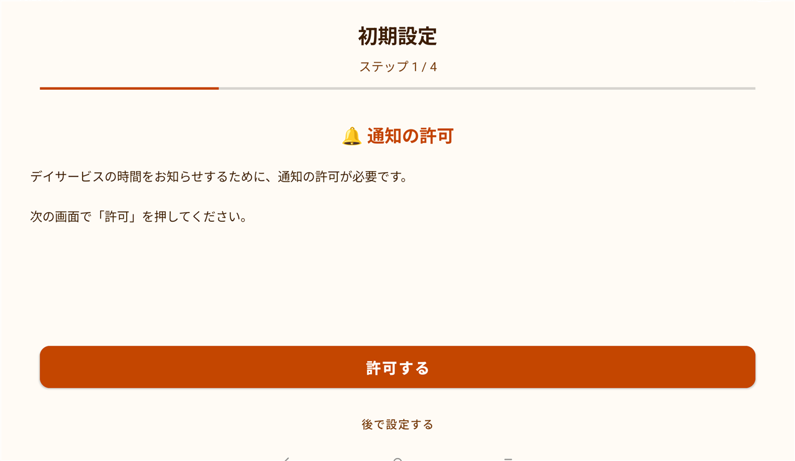
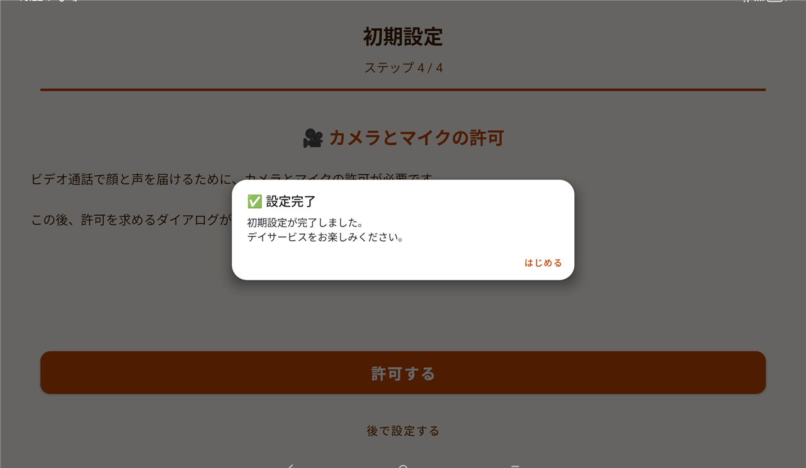

# オンラインデイサービス長老大学  Fireタブレット版アプリ 使い方ガイド

Amazon Fireタブレットから、オンラインデイサービス長老大学に参加するためのアプリの使い方です。
**参加する曜日と時間を一度だけ設定しておけば**、あとは時間になるとアプリが自動で起動して待機室に入ります。
**アプリを閉じていても、画面が消えていても、時間になれば自動で立ち上がります**ので、毎日の操作は基本いりません。

> 📌 **このアプリは「オンラインデイサービス長老大学」をご契約中の方向け**です。参加には、事務局よりご案内したログイン情報（メールアドレス・パスワード）が必要です。

> 💡 **おすすめの機種は「Fire Max 11」**です。それ以外のFireタブレットでは動作が不安定になる場合があります。より快適にご利用いただくには、ふつうのAndroidタブレットもおすすめです。

---

## ① アプリを入れる（最初に1回だけ）

1. お使いのFireタブレットで、次のリンクを開きます。
    👉 **[Amazonアプリストアでアプリを開く](https://www.amazon.co.jp/dp/B0H4SK9TQL)**
2. **「入手」**（または「ダウンロード」）を押すと、自動でインストールされます。
3. 終わったら **「開く」**、または次回からは**ホーム画面のアイコン**から起動できます。

> 💡 Amazonアプリストアで **「オンラインデイサービス長老大学」** と検索しても見つかります。

> 💡 Fireタブレットには、はじめからGoogle Playは入っていません。アプリは**Fireの「アプリストア」**から入れます。

---

## ② 最初の準備①：使う準備をする（初回セットアップ）

アプリを初めて起動すると、**初期設定（セットアップ）の画面**が順番に出てきます。
画面の案内にしたがって、**4つの「許可する」**を押していくだけです。

各画面で **「許可する」** を押し、続けて出てくる確認画面でも **「許可」** を押してください。

| 順番 | 画面 | なんのため？ |
|----|------|------------|
| 1 | 🔔 通知の許可 | デイサービスの時間をお知らせするため |
| 2 | ⏰ アラームの許可 | 時間ぴったりに自動で開くため |
| 3 | 🔋 電池の設定 | 時間どおりに自動で起動するため |
| 4 | 🎥 カメラとマイクの許可 | ビデオ通話で顔と声を届けるため |

すべて終わると、この画面が出ます。**「はじめる」**を押してください。

> 💡 「許可する」を押すと、Fireタブレットからの確認画面が出ます。**そのまま「許可」を押せばOK**です。むずかしく考えなくて大丈夫です。

---

## ③ 最初の準備②：参加する曜日・時間とログインを入れる

次に、**「いつ参加するか」**と**ログイン情報**を登録します。これも最初の1回だけです。

1. 待機画面の右上にある **「⚙ 設定」ボタンを長押し**（少し長めに押す）します。
2. 「設定画面を開きますか？」と出たら **「設定を開く」** を押します。

### 1. 参加する曜日とコマを選ぶ
表の中で、参加したい**曜日 × 時間**のマスをタップします。
タップするたびに **「参加」**（オレンジ色）と **「－」** が切り替わります。

- 例：上の画像は「**月〜金の1時間目と3時間目**」に参加する設定です。
- 毎週この予定がくり返されます。お休みの曜日は「－」のままでOKです。

### 2. ログイン情報を入れる
**事務局よりご案内したログイン情報（メールアドレス・パスワード）**を入力します。

### 3. 保存する
最後に **「💾 この内容で保存する」** を押せば完了です。

---

## ④ 毎日の使い方（自動でおまかせ）

設定が終わったら、もう操作はいりません。
待機画面には、**次にいつ参加するか**が表示されます。

- 時間になると、**自動でアプリが起動して待機室に入ります**。アプリを閉じていても、画面が消えていても大丈夫です。
- 授業が終わると、自動でこの待機画面に戻ります。

> 💡 **すぐに入りたいとき**は「手動参加」を押せば、その場で参加できます。

---

## ⑤ （おすすめ）アプリの画面を固定する

ご高齢の方が、まちがってほかの画面に行ってしまわないように、Fireタブレットには**「画面の固定」**という機能があります。設定しておくと、このアプリの画面から外れにくくなり安心です。

1. Fireの **「設定」** → **「セキュリティとプライバシー」** → **「画面の固定」** をオンにします。
2. アプリを開いた状態で、画面下の「最近使ったアプリ」ボタンから、このアプリを**固定**します。
3. 解除するときは、決められたボタン操作＋暗証番号が必要になります（=かんたんには外れません）。

> 💡 「画面の固定」がうまくいかない場合や、もっとしっかり固定したい場合は、事務局までご相談ください。

---

## 普段の状態・困ったとき

- ✅ **端末はそのまま置いておくだけ**でOKです。アプリを毎日開く必要はありません。
- ✅ 充電が切れないよう、**電源（充電器）につないだまま**にしておくと安心です。
- ✅ 参加する曜日・時間を変えたいときは、もう一度 **「⚙ 設定」ボタンを長押し**して設定画面から変更できます。
- ❓ うまく入れない・画面がおかしいときは、一度アプリを閉じて、もう一度起動してみてください。
- ℹ️ **Fireタブレットでは、ビデオ通話の「背景ぼかし」はご利用いただけません**（授業への参加・通話は問題なくお使いいただけます）。

---

## お問い合わせ

ご不明な点は、いつでもご連絡ください。

合同会社さわもと（オンラインデイサービス長老大学）
公式サイト：[https://chouroudaigaku-online.com/](https://chouroudaigaku-online.com/)

---

[トップに戻る](../../)
