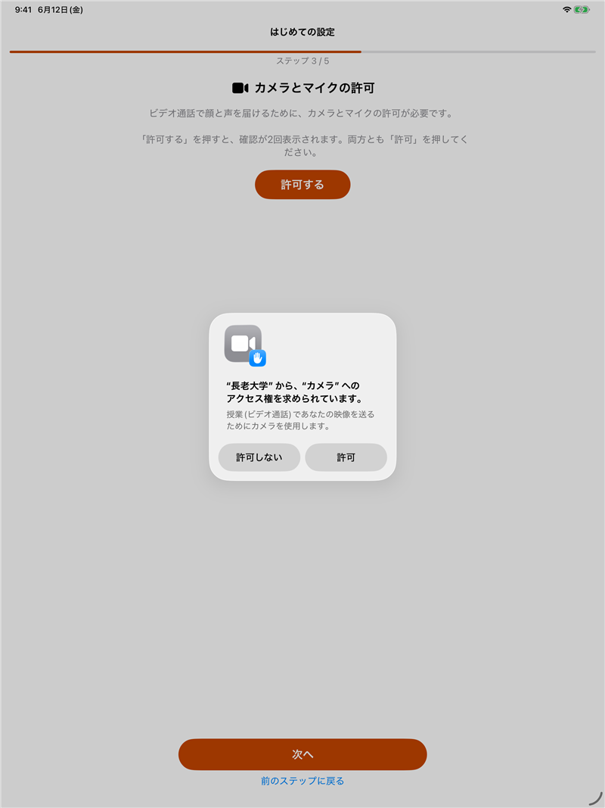
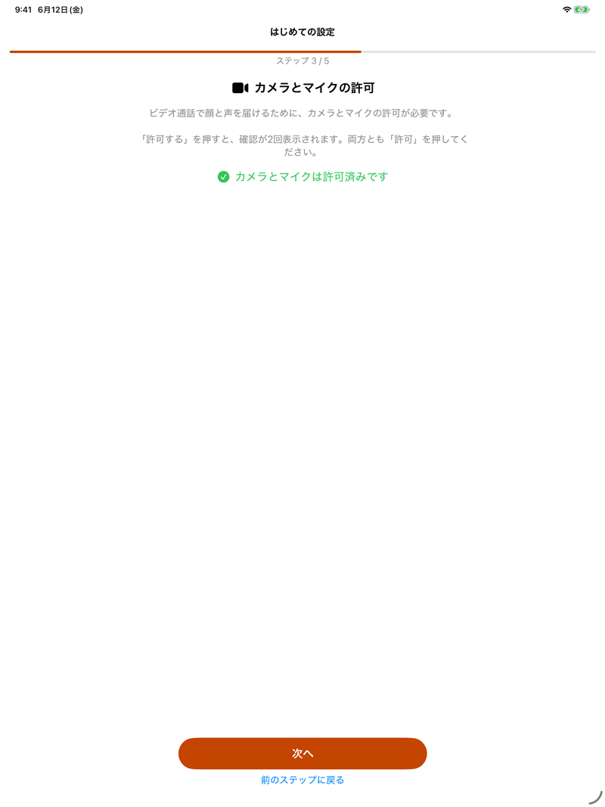

# オンラインデイサービス長老大学  iPad版アプリ 使い方ガイド（はじめての設定）

iPad（タブレット）から、オンラインデイサービス長老大学に参加するためのアプリの設定手順です。
**一度設定しておけば、時間になるとiPadがひとりでに授業に入ります。利用者ご本人の操作は一切いりません。**

> 👩‍👧 **この手順書は、設定をされるご家族・スタッフの方向け**です。所要時間は約15分です。

> 📌 **このアプリは「オンラインデイサービス長老大学」をご契約中の方向け**です。参加には、事務局よりご案内したログイン情報（メールアドレス・パスワード）が必要です。

> 🍏 **アプリの入手は現在準備中です（App Store 公開準備中）。** 入れ方は事務局からのご案内にしたがってください。公開後に、このページを差し替えます。

---

## 準備するもの

- 利用者さんの **iPad**（Wi-Fi に接続済み）
- 事務局よりご案内した **ログイン情報（メールアドレス・パスワード）**、または **設定リンク**
- **充電ケーブル**（さしたまま使います）

---

## 手順1　iPadの基本設定（約3分）

自動で授業に入るために、iPadを **「眠らせない・閉じない」** 設定にします。

1. **パスコード（ロック）を「なし」にする**
    設定アプリ →「Face ID（または Touch ID）とパスコード」→「パスコードをオフにする」
2. **自動ロックを「なし」にする**
    設定アプリ →「画面表示と明るさ」→「自動ロック」→「なし」
3. iPadは **充電ケーブルをさしたまま**、見やすい場所に立てて据え置きます。

> 💡 夜は、アプリが画面を黒くしてまぶしさを防ぎます（設定でオン／オフできます）。

---

## 手順2　アプリを入れる

現在、**App Storeでの公開準備中**です。アプリの入れ方は、事務局からのご案内にしたがってください。
 （公開後に、このページを差し替えます）

---

## 手順3　はじめての設定（約5分）

アプリを初めて開くと、自動で **「はじめての設定」** が始まります。画面の案内にそって **「次へ」** を押していくだけです。

### ステップ1　ようこそ
**「次へ」**を押します。

### ステップ2　ログイン情報
事務局よりご案内した **「設定リンク」をこのiPadで開く**と、自動でここに入ります（おすすめ）。
 リンクがない場合は、**メールアドレスとパスワードを直接入力**してください。

### ステップ3　カメラとマイクの許可
**「許可する」**を押すと、確認が2回表示されます。**どちらも「許可」**を押してください。

### ステップ4　時間割
利用者さんが参加するコマ（曜日と時間）を **オン（緑）** にします。あとから設定画面でいつでも変更できます。

### ステップ5　仕上げ
ショートカット登録（次の手順4）のご案内が表示されます。**「設定を完了する」**を押すと、待ち受け画面に進みます。

---

## 手順4　毎朝の保険起動を登録（約3分）

アプリが何かのはずみで閉じられても、**毎朝、自動で開き直す**ための設定です。
 **一度登録すれば、その後は触りません**（時間割を変えても、ここのやり直しは不要です）。

1. iPadの **「ショートカット」アプリ** を開きます。

   

2. 左の一覧から **「オートメーション」** を選び、**「新規オートメーション」** を押します。
    一覧から **「時刻」** を選びます。

   

3. 時刻を **「9:00」**（授業より前の時刻ならいつでも）、繰り返しを **「毎日」**、下の **「すぐに実行」** を選んで、右上の **「次へ」** を押します。

   

   

4. アプリの一覧から **「長老大学」** を選びます。

   

5. **「アプリを開く」** を選べば登録完了です。

   

---

## 手順5　ガイド付きアクセス（専用機の場合のおすすめ・約3分）

誤ってアプリから出てしまわないように、**「長老大学アプリから出られない」状態**にできるiPadの機能です。
 オンラインデイ専用のiPadとして使う場合におすすめします。

1. 設定アプリ →「アクセシビリティ」→ 一番下の **「ガイド付きアクセス」** → **オン**
2. **「パスコード設定」** で、設定担当の方だけが知る **6桁の番号** を決めます。
3. 長老大学アプリを開いた状態で、iPad上部のボタン（ホームボタンのあるiPadはホームボタン）を **すばやく3回押す** →**「開始」**
4. 解除するとき：もう一度ボタンを3回押し、パスコードを入れて **「終了」** を押します。

> ⚠️ **大事な注意**：停電や再起動のあと、ガイド付きアクセスは自動では戻りません。アプリ自体は翌朝、自動で開きますが、**「ボタン3回押し →開始」だけ、もう一度**お願いします。

---

## 手順6　動作テスト（約1分）

1. 待ち受け画面の **右上の歯車（設定）** を開きます。
2. **「テスト（1分後に自動参加）」** を押し、**「セットする」** を選びます。
3. 約1分後、**ひとりでに授業へ入る動き**をすれば合格です。
    （授業時間外は入室できないため、しばらくすると自動で待ち受けに戻ります）

---

## 仕上げ：利用者モードに切り替える

設定画面の **「利用者モードに切り替える」** を押すと、設定ボタンなどが画面から消えて、利用者さん向けのシンプルな画面になります。

- **管理者に戻すとき**：待ち受け画面の **「次の参加予定」カードを10秒間長押し**します。

---

## 困ったときは

- **画面が真っ黒** → 夜間のおやすみ画面です。画面にふれると明るくなります。
- **授業を途中で退出したら、その日はもう自動で入らない** → そういう仕組みです（同じコマには、その日中は再入室しません）。入りたいときは **「今すぐ授業に入る」** を押してください。
- **アプリが閉じてしまった** → 翌朝の保険起動で自動で戻ります。すぐ使いたいときは、アプリのアイコンをタップしてください。
- **時間割を変えたい** → 待ち受け画面の歯車（設定）から変更できます。ショートカットの再設定はいりません。

---

## お問い合わせ

ご不明な点は、いつでもご連絡ください。

合同会社さわもと（オンラインデイサービス長老大学）
フリーダイヤル：0120-962-097
公式サイト：[https://chouroudaigaku-online.com/](https://chouroudaigaku-online.com/)

---

[トップに戻る](../../)
