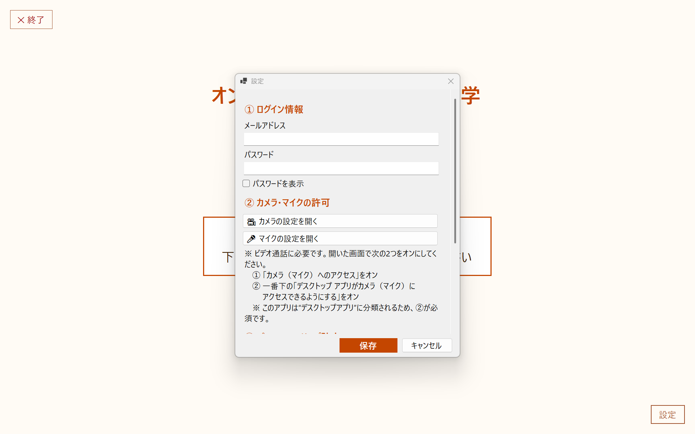
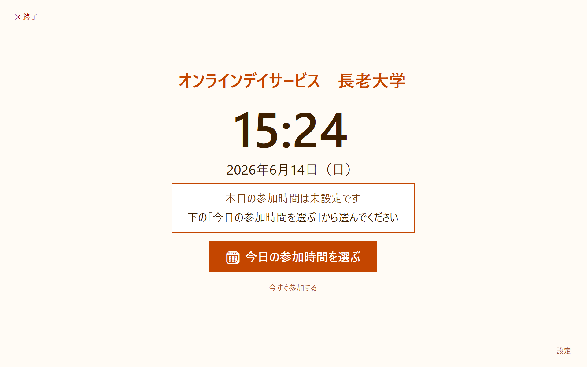
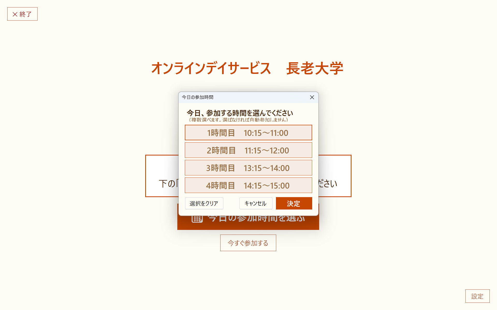

# オンラインデイサービス長老大学  Windows版アプリ 使い方ガイド

パソコン（Windows）から、オンラインデイサービス長老大学に参加するためのアプリの使い方です。
**毎朝ブラウザを開いてURLを入力する手間がなくなり**、参加する時間になるとアプリが自動で待機室に入ります。

> 📅 **Windows版は「その日のぶん」を、毎朝えらんで使うアプリです。**
>
> 次の2つの使い方を想定しています。
>
> - **同居のご家族がパソコンを準備する場合** … ご家族が朝、今日参加する時間をセットしてからお出かけください。
> - **ご本人がパソコンを操作する場合** … ご本人が、参加する時間に画面のボタンを押して参加します。
>
> どちらの場合も、**パソコンとアプリは開いたまま**にしておいてください（閉じると自動では入りません）。

> 🏠 **おひとり暮らしなどで、毎朝のセットがむずかしい場合**は、参加する曜日・時間を一度だけ設定すれば、あとは自動でアプリが立ち上がる **[Android版（タブレット）アプリ](../android-app/)** が向いています。

> 📌 **このアプリは「オンラインデイサービス長老大学」をご契約中の方向け**です。参加には、事務局よりご案内したログイン情報（メールアドレス・パスワード）が必要です。

---

## ① アプリを入れる（最初に1回だけ）

> ⚠️ **必ず「パソコン（Windows）」で行ってください。** スマートフォンでは入りません。

1. パソコンのブラウザで、次のリンクを開きます。
    👉 **[https://apps.microsoft.com/detail/9PPJVJVMCQBV](https://apps.microsoft.com/detail/9PPJVJVMCQBV)**
2. 「**Microsoft Store を開く**」と出たら開きます。
3. **「入手（Get）」** ボタンを押すと、自動でインストールされます。
4. 終わったら **「開く」**、または次回からは**スタートメニュー**の「オンラインデイサービス長老大学」から起動できます。

---

## ② 最初の設定（最初に1回だけ）

アプリを初めて起動すると、設定画面が開きます。**事務局よりご案内したログイン情報（メールアドレス・パスワード）**を入れて保存します。

1. **① ログイン情報** に、事務局よりご案内した**メールアドレス**と**パスワード**を入力
2. **「保存」** を押す
3. **② カメラ・マイクの許可** … ビデオ通話に必要です。「カメラの設定を開く」「マイクの設定を開く」から、画面の案内どおり**オン**にしてください
   - はじめてカメラ・マイクを使うとき「許可しますか？」と聞かれたら **「許可」** を押してください

> 設定は最初の1回だけです。次回からは②は不要です。

---

## ③ 毎日の使い方（これだけ！）

### 1. アプリを起動する
大きな時計の画面（待機画面）が出ます。

### 2.「🗓 今日の参加時間を選ぶ」を押す
今日参加する時間（1〜4時間目）を選んで、**「決定」**を押します（複数選んでもOK）。

### 3. アプリは開いたまま・パソコンもつけたままに
あとは何もしなくて大丈夫。**授業開始の5分前に、アプリが自動で待機室に入室**します。
授業が終わると、自動でこの待機画面に戻ります。

> 💡 **すぐに入りたいとき**は「今すぐ参加する」を押せば、その場で参加できます。

---

## 終わるとき

- 完全にやめるときは、画面**左上の「✕ 終了」**で閉じます。
- 翌朝は、またアプリを起動して「今日の参加時間を選ぶ」だけでOKです。

---

## 大切なポイント・困ったとき

- ✅ **パソコンの電源は入れたまま／アプリは閉じずに**おいてください（閉じると自動では入りません。アプリが開いている間はパソコンが眠らないようになっています）。
- ✅ 参加する時間は**毎朝（その日に出る分だけ）選びます**。
- ❓ うまく入れない・画面がおかしいときは、一度「✕ 終了」してから、もう一度起動してみてください。

---

## お問い合わせ

ご不明な点は、いつでもご連絡ください。

合同会社さわもと（オンラインデイサービス長老大学）
公式サイト：[https://chouroudaigaku-online.com/](https://chouroudaigaku-online.com/)

---

[トップに戻る](../../)
